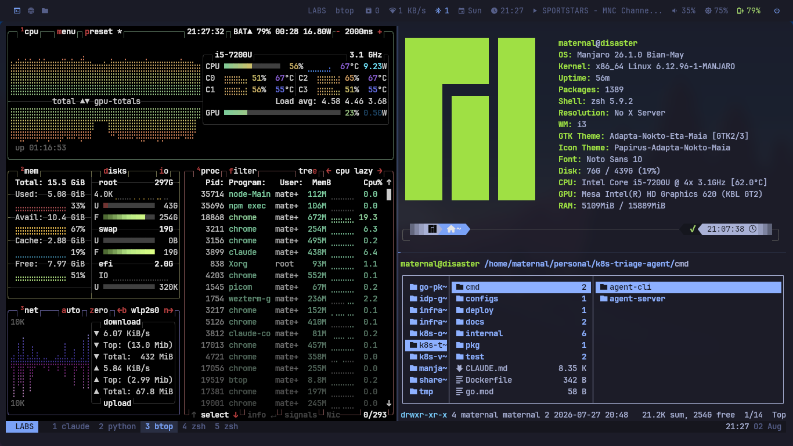

# manjaro-i3

A dark, quiet i3 desktop for a laptop. TokyoNight throughout, with Dracula and
Gruvbox as drop-in alternates. Built to be copied, tweaked, and used — not
admired in a screenshot.

Structure and conventions follow [mino29/arch-i3](https://github.com/mino29/arch-i3):
split polybar modules, role-named theme files, one palette per program.



**[OPERATIONS.md](OPERATIONS.md)** — day-to-day usage: copy/paste, Wi-Fi,
bluetooth, screenshots, theme switching, and what to check when something
breaks. This file is the reference; that one is the how-to.

```
i3        window manager        wezterm   terminal (primary)
polybar   status bar            tmux      multiplexer
rofi      launcher + menus      xterm     fallback terminal
dunst     notifications         kitty     alternate terminal (configured)
picom     compositor            zsh       shell
```

---

## Install

```bash
git clone <this repo> ~/personal/manjaro-i3
cd ~/personal/manjaro-i3
./install.sh
```

Then log out and back in.

| Flag | What it does |
| --- | --- |
| `--dry-run` | Print every action, change nothing. Run this first. |
| `--link-only` | Symlinks only — no pacman, no systemctl, no `/etc` |
| `--packages` | Install packages and stop |
| `--no-x11` | Skip the `/etc/X11` touchpad and mouse rules |

Everything replaced is backed up to `~/.dotfiles-backup/<timestamp>/` first.
Configs are **symlinked**, so editing `~/.config/i3/config` edits the file in
this repo — that's deliberate.

Verify at any point with:

```bash
./check.sh
```

It runs each program's own validator and then checks cross-file wiring
(polybar modules that are referenced but never defined, `include-file` paths
that don't resolve, keybindings pointing at scripts that don't exist).

---

## Development tools

A separate, opt-in installer for the cloud/SRE/DevOps toolchain:

```bash
./development-tools.sh                    # show the groups
./development-tools.sh --dry-run --all    # see what it would do
./development-tools.sh --all              # repo packages only
./development-tools.sh --all --aur        # + the 7 AUR extras
./development-tools.sh --go --k8s         # just those groups
```

| Group | Contents |
| --- | --- |
| `base` | git, git-lfs, jq, yq, ssh, build tools |
| `go` | **Go via [GVM](https://gvm.sh)** + gopls, delve |
| `containers` | docker, compose, buildx, lazydocker, dive |
| `iac` | terraform, terragrunt, opentofu, tflint, packer, vault, ansible |
| `k8s` | kubectl, helm, k9s, kubectx, kustomize, kind, minikube, stern, argocd, sops, trivy |
| `cloud` | aws-cli-v2, azure-cli |
| `cli` | direnv, lazygit, gh, glab, pyenv, node, fzf, ripgrep, bat, eza |
| `net` | mtr, nmap, tcpdump, dig, whois, socat |
| `apps` | VS Code (OSS build) |
| `aur` | terraform-docs, gcloud, VS Code (MS build), Notion, k6, infracost, kubecolor |

**53 of the 60 packages are in Manjaro's official repos** — only the `aur`
group needs `yay`, and it's opt-in.

Go is *not* installed from pacman. GVM manages toolchains instead:

```bash
gvm list                    # installed versions
gvm install 1.25.0
gvm use 1.25.0 --default
```

The GVM installer is run with `GVM_NO_MODIFY=1` — it would otherwise append to
`~/.zshrc`, which here is a symlink into this repo. The shell integration lives
in `zsh/completions.zsh` instead, so it's version-controlled and can't be
duplicated on re-runs.

### Completions

`zsh/completions.zsh` caches each tool's completion script to
`~/.cache/zsh/completions` and regenerates one only when the binary is newer
than its cache — running ~20 `<tool> completion zsh` calls on every shell start
would cost 300ms+. Rebuild manually with `gen-completions`.

It also sets up `direnv`, `pyenv`, `GOPATH`, and the usual aliases (`k`,
`tf`, `tg`, `d`, `dc`, `lg`) with completion inherited via `compdef`.

`terraform`, `terragrunt`, `vault`, `packer`, `consul`, `nomad` and `aws` don't
emit zsh scripts — they use the bash-style `complete -C` protocol, wired up via
`bashcompinit`.

---

## Keybindings

`$mod` is **Super**. Press `$mod+Shift+/` for a live cheatsheet — it's parsed
out of the i3 config itself, so it can't go stale.

### Launching

| Key | Action |
| --- | --- |
| `$mod+Return` | WezTerm |
| `$mod+Shift+Return` | xterm (fallback) |
| `$mod+d` | App launcher |
| `$mod+Shift+d` | Run any command |
| `$mod+Tab` | Window switcher (all workspaces) |
| `$mod+w` / `$mod+n` / `$mod+c` | Browser / files / editor |
| `$mod+m` | Music (ncmpcpp) |
| `$mod+.` / `$mod+=` | Emoji picker / calculator |
| `$mod+Shift+e` | Power menu |
| `$mod+Shift+w` | Wi-Fi picker (also: click the network module in polybar) |

### Windows

| Key | Action |
| --- | --- |
| `$mod+q` | Close |
| `$mod+Shift+q` | Force-kill (click the window) |
| `$mod+h/j/k/l` | Focus left/down/up/right (arrows work too) |
| `$mod+Shift+h/j/k/l` | Move window |
| `$mod+f` | Fullscreen |
| `$mod+s` / `$mod+t` / `$mod+e` | Stacking / tabbed / split layout |
| `$mod+Shift+space` | Float toggle |
| `$mod+r` | Resize mode (`h/j/k/l`, Escape to exit) |
| `$mod+g` | Gaps mode |
| `$mod+minus` / `$mod+Shift+minus` | Show / send to scratchpad |

Splits are handled by `autotiling` — new windows split the wider axis
automatically, so you rarely need `$mod+b` / `$mod+v`.

### Workspaces

`$mod+1..0` to switch, `$mod+Shift+1..0` to move a window there.
`$mod+Ctrl+h/l` cycles, `Alt+Tab` jumps to the last one.

Chrome/Firefox/Zen → 3, Thunar → 4, music → 5, video → 6 by default.

### Screenshots

| Key | Action |
| --- | --- |
| `Print` | Whole screen |
| `Shift+Print` | Select a region |
| `Ctrl+Print` | Active window |

All three save to `~/Pictures/Screenshots` **and** copy to the clipboard.

### Session

`$mod+Shift+c` reload · `$mod+Shift+r` restart · `$mod+Shift+x` lock

Laptop keys (volume, brightness, media) work as labelled and show an OSD.
Media keys use `playerctl`, so they drive Chrome, mpv, VLC, Spotify and mpd
alike. `$mod+F9` toggles the touchpad.

---

## tmux

Prefix is **`Ctrl+a`**.

| Key | Action |
| --- | --- |
| `prefix \|` / `prefix -` | Split vertical / horizontal (keeps cwd) |
| `prefix h/j/k/l` | Move between panes |
| `prefix H/J/K/L` | Resize |
| `prefix f` | Zoom pane |
| `prefix s` | Session switcher |
| `prefix Enter` | Copy mode (vi keys, `y` copies to X clipboard) |
| `prefix r` | Reload config |

The `tt` shell function starts or attaches to a session named after the
current directory — run `tt` in a project and you're set.

---

## Theming

One palette, three programs deep. To switch schemes:

| Program | Change |
| --- | --- |
| polybar | the `include-file` line at the top of `polybar/config.ini` |
| rofi | the `@import` line in `rofi/config.rasi` |
| wezterm | `THEME` at the top of `wezterm/wezterm.lua` |
| kitty | the `include` line in `kitty/kitty.conf` |
| tmux | the `%hidden` colour block in `tmux/tmux.conf` |
| xterm | the `#define` block in `xterm/Xresources` |

Each theme file uses the same **role names** — `background`, `foreground`,
`highlight`, `lowlight`, `healthy`, `warning`, `dangerous` — so modules never
reference a raw hex value and swapping schemes touches one line per program.
See `colors/README.md`.

TokyoNight values are copied from
[folke/tokyonight.nvim](https://github.com/folke/tokyonight.nvim) upstream, so
they match Neovim exactly.

---

## The status bar

Styled after the bar in [mino29/arch-i3](https://github.com/mino29/arch-i3):
full width and flush to the top, opaque, no rounded corners, **muted grey text
by default** with colour used sparingly, and the focused window title centred.

Left: workspace icons. Centre: window title. Right: updates · network ·
bluetooth · date · time · music · volume · brightness · battery · power · tray.

The network module shows download throughput. To see or change the network,
**press `$mod+Shift+w`, or click the module**. The picker lists everything in range with
signal strength and security, prompts for a password on new networks, and can
disconnect, rescan, or open the full connection editor.

Colour only appears where it earns attention — focused workspace, battery
level, power, and volume *when muted*. Everything else recedes.

Sized for a 1366×768 panel: `module-margin = 1` gives ~17px gaps, the same
proportion as the reference's ~30px at 1920px, and is what lets the centred
title actually sit centred rather than being shoved left by the right cluster.

Not enabled by default but ready in `polybar/modules/system.ini`: `cpu`,
`memory`, `filesystem`. Add them to `modules-right` in `polybar/config.ini`.

**No tray applets.** `nm-applet`, `blueman-applet` and `pamac-tray` are all
suppressed (via `x11/autostart/`), because each drew a full-colour GTK icon
that clashed with the Nerd Font glyphs everywhere else in the bar. Each is
replaced by a native module:

| Applet | Replaced by | Click does |
| --- | --- | --- |
| `nm-applet` | `[module/wlan]` | opens the rofi Wi-Fi picker |
| `blueman-applet` | `[module/bluetooth]` | left: blueman-manager · right: toggle |
| `pamac-tray` | `[module/updates]` | opens `pamac-manager --updates` |

The tray module is still in the bar — it just collapses to zero width when
nothing is using it, so apps like Chrome or Discord still get a slot.

The music module uses `playerctl`, not mpd — so it shows whatever is actually
playing, including a YouTube tab. Click to play/pause, right-click to skip,
scroll to change that app's volume.

---

## Hardware assumptions

Detected from the machine this was built on. If you move these dotfiles,
these are the values to change:

| Setting | Value | Where |
| --- | --- | --- |
| Display | `eDP-1` | `bin/display-menu` |
| Battery / adapter | `BAT0` / `AC` | `polybar/modules/battery.ini` |
| Backlight | `intel_backlight` | `polybar/modules/backlight.ini` |
| Wi-Fi | `wlp2s0` | `polybar/modules/network.ini`, `rofi/scripts/wifi` |
| Ethernet | `enp3s0` | `polybar/modules/network.ini` |

Check yours with `xrandr`, `ls /sys/class/power_supply`,
`ls /sys/class/backlight`, and `ls /sys/class/net`.

---

## Touchpad and mouse

Two files in `x11/`, installed to `/etc/X11/xorg.conf.d/`:

**Touchpad** — tap to click, two-finger scroll, natural scrolling,
clickfinger buttons, and disable-while-typing (the setting that matters most).

**Mouse** — deliberately the opposite: natural scrolling **off** and a flat
acceleration profile. A wheel isn't a surface you're dragging, and matching
the touchpad there feels wrong to nearly everyone.

`bin/input-setup` re-applies the same settings at runtime, so hotplugging a
mouse and pressing `$mod+Shift+r` picks it up without a logout.

---

## Notes

**Lock screen.** Manjaro's repos only carry plain `i3lock`, not `i3lock-color`.
`bin/lock` grabs the screen, blurs it with ImageMagick, and tints it toward
TokyoNight; if any part of that is unavailable it falls back to a flat colour.
Locking never fails.

Because i3lock holds a keyboard grab, i3 never sees your media keys while
locked. i3 also has no `--locked` flag — that's a sway extension. This is a
plain-i3lock limitation, not a misconfiguration.

**Audio.** `wireplumber` and `pipewire-pulse` were not enabled on this machine.
Without them there is no sound and polybar's volume module shows nothing —
`install.sh` enables both.

**Shell.** `.zshrc` is framework-free: no oh-my-zsh, just the plugin packages
from the repos sourced out of `/usr/share`. Starts in well under 100ms. Run
`p10k configure` once to build your prompt.

If you currently use oh-my-zsh or oh-my-tmux, `install.sh` backs those configs
up rather than merging with them — these files replace them outright.

**A harmless warning.** dunst prints `Could not find theme breeze-dark` on
startup. That comes from dunst's own compiled-in default, not this config;
`Papirus-Dark` is what's actually used.

---

## Layout

```
├── install.sh          backup-then-symlink installer
├── check.sh            syntax + cross-file wiring validation
├── packages.txt        80 packages, all from official repos
├── colors/             the palette, and what each role means
├── i3/config           window manager + scripts/
├── polybar/            config.ini · modules/ · themes/ · scripts/
├── rofi/               config.rasi · themes/ · scripts/
├── dunst/dunstrc
├── picom/picom.conf
├── wezterm/wezterm.lua
├── tmux/tmux.conf
├── kitty/              kitty.conf · themes/
├── xterm/Xresources
├── zsh/                zshrc · aliases.zsh · functions.zsh
├── x11/                touchpad + mouse rules for /etc/X11/xorg.conf.d
└── bin/                lock · volume · brightness · screenshot · …
```
